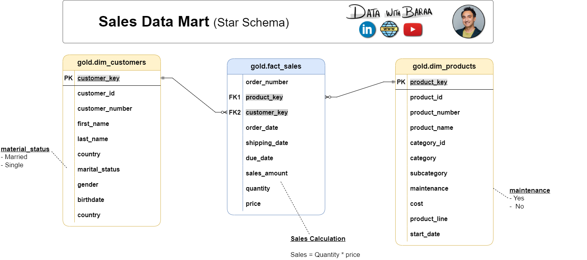
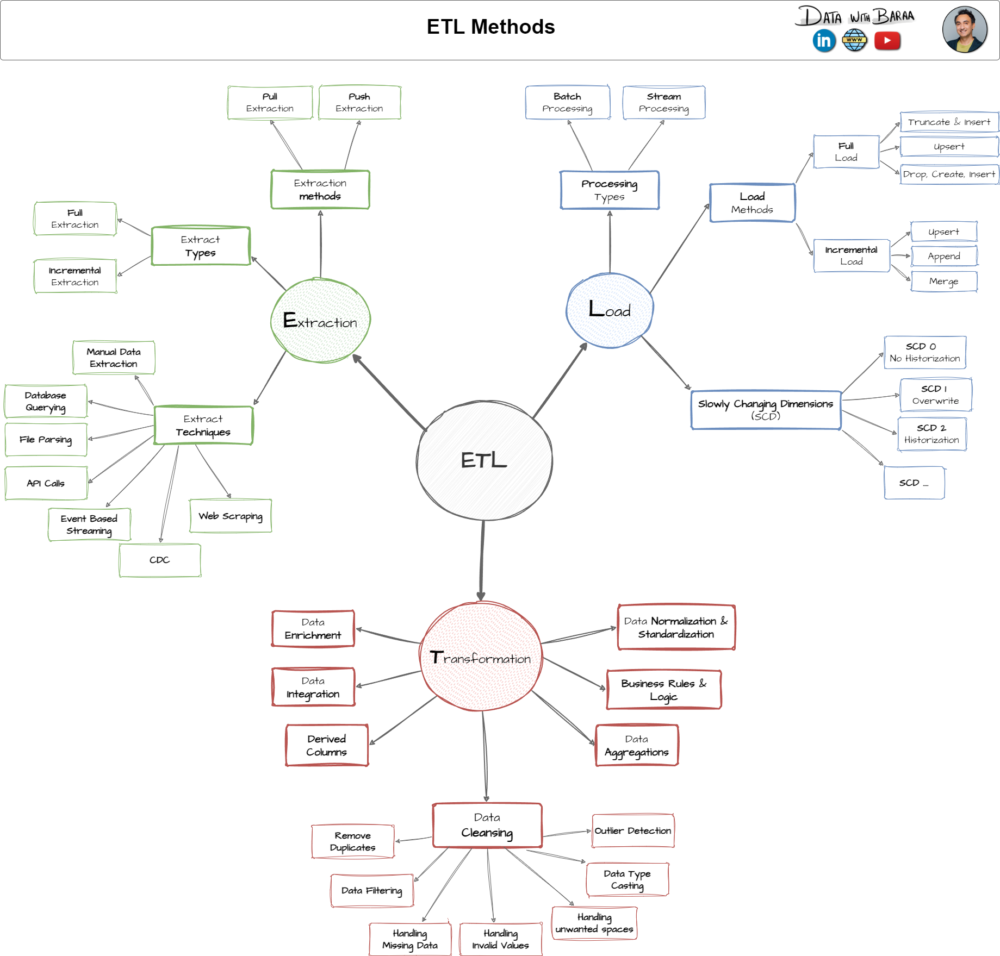
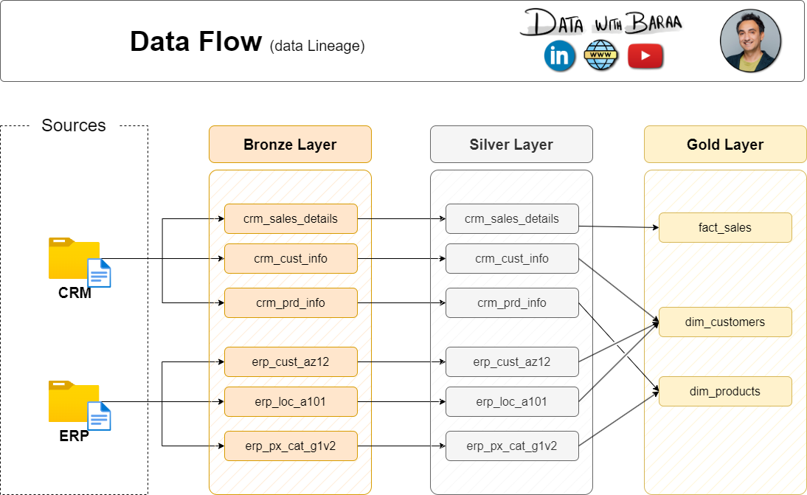

# 🏭 Sales Analytics Data Warehouse

<div align="center">


<br/>

> **A production-grade, Medallion Architecture data warehouse built on Microsoft SQL Server.**  
> Ingests raw CRM & ERP data, transforms it through three refinement layers, and delivers  
> a clean Star Schema ready for BI reporting, ad-hoc analytics, and machine learning.

<br/>

[📐 Architecture](#-architecture) · [🚀 Quick Start](#-quick-start) · [📁 Project Structure](#-project-structure) · [📊 Data Model](#-data-model) · [🧪 Quality Checks](#-data-quality) · [📖 Docs](#-documentation)

</div>

---

## 🌟 Highlights

| Feature | Details |
|---|---|
| 🏗️ **Architecture** | Medallion (Bronze → Silver → Gold) |
| 🗄️ **Database** | Microsoft SQL Server |
| 🔀 **Sources** | CRM System + ERP System (CSV flat files) |
| 🔄 **ETL Pattern** | Truncate & Insert via Stored Procedures |
| 📐 **Data Model** | Star Schema (Dimensions + Fact Table) |
| ✅ **Quality** | Automated SQL quality checks on Silver & Gold layers |
| 📚 **Docs** | Full data catalog + naming conventions |

---

## 📐 Architecture

This project implements the **Medallion Architecture** — a layered data design pattern that progressively refines raw data into business-ready insights.

```
  ┌─────────┐     ┌──────────────┐     ┌──────────────┐     ┌──────────────┐     ┌────────────────┐
  │ Sources │────▶│ Bronze Layer │────▶│ Silver Layer │────▶│  Gold Layer  │────▶│    Consume     │
  └─────────┘     └──────────────┘     └──────────────┘     └──────────────┘     └────────────────┘
   CRM (CSV)        Raw / As-Is          Cleansed &            Star Schema          BI & Reporting
   ERP (CSV)        Full Load            Standardized          Dim + Fact           Ad-Hoc Queries
                    Stored Proc          Stored Proc           SQL Views            Machine Learning
```


### 🥉 Bronze Layer — *Raw Ingestion*
- Loads source data **as-is** directly from CSV files
- No transformations applied — preserves original fidelity
- Object type: **Tables**
- Load pattern: **Truncate & Insert** (Full Load via Stored Procedure)
- Source systems: `crm_*` and `erp_*` tables

### 🥈 Silver Layer — *Cleanse & Standardize*
- Applies **data cleansing**, **standardization**, and **normalization**
- Handles: deduplication, null handling, date format fixes, derived columns, data enrichment
- Object type: **Tables**
- Load pattern: **Truncate & Insert** (Full Load via Stored Procedure)

### 🥇 Gold Layer — *Business-Ready*
- Exposes data as a clean **Star Schema** for analytics
- Applies business logic, data integrations, and aggregations
- Object type: **SQL Views** (no physical load required)
- Consumers: BI tools, reporting dashboards, ML pipelines

---

## 🚀 Quick Start

### Prerequisites

- Microsoft SQL Server (2019+ recommended)
- SQL Server Management Studio (SSMS) or Azure Data Studio
- Access to source CSV files (CRM & ERP datasets)

### Step-by-Step Setup

**1. Initialize the Database**

Run the database setup script to create the `DataWarehouse` database and all three schemas:

```sql
-- Creates database + bronze, silver, gold schemas
-- ⚠️ WARNING: Drops existing DataWarehouse DB if present
scripts/init_database.sql
```

**2. Create Bronze Layer Tables**

```sql
scripts/bronze/ddl_bronze.sql
```

**3. Load Bronze Layer**

```sql
EXEC bronze.load_bronze;
```

> 📝 Before running, update the file paths in the stored procedure to point to your local CSV files.

**4. Create Silver Layer Tables**

```sql
scripts/silver/ddl_silver.sql
```

**5. Load Silver Layer**

```sql
EXEC silver.load_silver;
```

**6. Create Gold Layer Views**

```sql
scripts/gold/ddl_gold.sql
```

**7. Run Quality Checks** *(optional but recommended)*

```sql
tests/quality_checks_silver.sql
tests/quality_checks_gold.sql
```

---

## 📁 Project Structure

```
Sales-Analytics-Data-Warehouse/
│
├── 📁 scripts/
│   ├── init_database.sql           # 🗄️ DB + schema initialization
│   ├── 📁 bronze/
│   │   ├── ddl_bronze.sql          # Table definitions for raw ingestion
│   │   └── proc_load_bronze.sql    # Stored procedure: load raw CSV → Bronze
│   ├── 📁 silver/
│   │   ├── ddl_silver.sql          # Table definitions for cleansed data
│   │   └── proc_load_silver.sql    # Stored procedure: Bronze → Silver ETL
│   └── 📁 gold/
│       └── ddl_gold.sql            # SQL Views: Silver → Star Schema (Gold)
│
├── 📁 tests/
│   ├── quality_checks_silver.sql   # ✅ Data quality checks for Silver layer
│   └── quality_checks_gold.sql     # ✅ Data quality checks for Gold layer
│
├── 📁 docs/
│   ├── data_catalog.md             # 📖 Full Gold layer data catalog
│   ├── naming_conventions.md       # 📏 Naming standards & conventions
│   ├── data_architecture.png       # 🏗️ High-level architecture diagram
│   ├── data_model.png              # 📐 Star schema data model
│   ├── data_flow.png               # 🔀 Data flow diagram
│   ├── data_integration.png        # 🔗 Integration diagram
│   └── ETL.png                     # ⚙️ ETL pipeline diagram
│
├── 📁 datasets/                    # 📦 Source CSV files (CRM & ERP)
├── LICENSE
└── README.md
```

---

## 📊 Data Model

The **Gold Layer** exposes a clean **Star Schema** with two dimension tables and one central fact table.



### ⭐ Star Schema Overview

```
                    ┌───────────────────┐
                    │  gold.dim_customers│
                    │─────────────────── │
                    │ customer_key  (PK) │
                    │ customer_id        │
                    │ customer_number    │
                    │ first_name         │
                    │ last_name          │
                    │ country            │
                    │ marital_status     │
                    │ gender             │
                    │ birthdate          │
                    │ create_date        │
                    └────────┬──────────┘
                             │
                             │ customer_key
                             ▼
┌───────────────────┐  ┌──────────────────────┐
│  gold.dim_products│  │   gold.fact_sales     │
│───────────────────│  │──────────────────────│
│ product_key  (PK) │◀─│ order_number          │
│ product_id        │  │ product_key      (FK) │
│ product_number    │  │ customer_key     (FK) │
│ product_name      │  │ order_date            │
│ category_id       │  │ shipping_date         │
│ category          │  │ due_date              │
│ subcategory       │  │ sales_amount          │
│ maintenance       │  │ quantity              │
│ cost              │  │ price                 │
│ product_line      │  └──────────────────────┘
│ start_date        │
└───────────────────┘
```

### 📋 Gold Layer — Data Catalog Summary

#### `gold.dim_customers`
Enriched customer dimension combining **CRM** demographic data with **ERP** geographic and personal information.

| Column | Type | Description |
|---|---|---|
| `customer_key` | INT | Surrogate key (auto-generated) |
| `customer_id` | INT | Original CRM customer ID |
| `customer_number` | NVARCHAR(50) | Alphanumeric tracking reference |
| `first_name` | NVARCHAR(50) | Customer first name |
| `last_name` | NVARCHAR(50) | Customer last name |
| `country` | NVARCHAR(50) | Country of residence |
| `marital_status` | NVARCHAR(50) | `Married` / `Single` |
| `gender` | NVARCHAR(50) | `Male` / `Female` / `n/a` |
| `birthdate` | DATE | Date of birth (YYYY-MM-DD) |
| `create_date` | DATE | Record creation date |

#### `gold.dim_products`
Product dimension enriched with category hierarchy from **ERP**, filtered to current active products only.

| Column | Type | Description |
|---|---|---|
| `product_key` | INT | Surrogate key (auto-generated) |
| `product_id` | INT | Internal product identifier |
| `product_number` | NVARCHAR(50) | Structured alphanumeric code |
| `product_name` | NVARCHAR(50) | Descriptive product name |
| `category` | NVARCHAR(50) | High-level group (e.g., Bikes) |
| `subcategory` | NVARCHAR(50) | Sub-group (e.g., Mountain Bikes) |
| `product_line` | NVARCHAR(50) | Road / Mountain / Touring / Other |
| `cost` | INT | Base unit cost |
| `maintenance` | NVARCHAR(50) | `Yes` / `No` |
| `start_date` | DATE | Availability start date |

#### `gold.fact_sales`
Central fact table capturing all transactional sales events, linked to both dimension tables.

| Column | Type | Description |
|---|---|---|
| `order_number` | NVARCHAR(50) | Unique order identifier (e.g., `SO54496`) |
| `product_key` | INT | FK → `dim_products` |
| `customer_key` | INT | FK → `dim_customers` |
| `order_date` | DATE | Date order was placed |
| `shipping_date` | DATE | Date order was shipped |
| `due_date` | DATE | Payment due date |
| `sales_amount` | INT | Total monetary value of line item |
| `quantity` | INT | Units ordered |
| `price` | INT | Price per unit |

---

## ⚙️ ETL Pipeline



The ETL pipeline is orchestrated through **SQL Server Stored Procedures** with built-in execution logging and error handling.

### Bronze Load (`bronze.load_bronze`)
- Reads flat CSV files from disk
- Bulk inserts into raw Bronze tables
- Logs load duration per table
- Full TRY/CATCH error handling

### Silver Load (`silver.load_silver`)
Applies the following transformations per table:

| Transformation | Example |
|---|---|
| **Trim whitespace** | `TRIM(cst_firstname)` |
| **Deduplicate** | `ROW_NUMBER() OVER (PARTITION BY cst_id ORDER BY cst_create_date DESC)` |
| **Normalize codes** | `'S' → 'Single'`, `'M' → 'Married'`, `'F' → 'Female'` |
| **Date conversion** | Integer `20210115` → `DATE '2021-01-15'` |
| **Null handling** | `ISNULL(prd_cost, 0)` |
| **Derived columns** | Product end date via `LEAD()` window function |
| **Business rules** | Recalculate `sales = quantity × price` when inconsistent |
| **Key extraction** | Parse category ID and product key from composite key string |

### Gold Views (`ddl_gold.sql`)
- No physical load — views computed on-demand
- Joins Silver tables across CRM & ERP sources
- Generates surrogate keys with `ROW_NUMBER()`
- Applies final business logic (e.g., CRM gender takes precedence over ERP)

---

## 🧪 Data Quality

Comprehensive quality check scripts are included for both **Silver** and **Gold** layers.



### Checks Performed

| Check | Layer | Tables |
|---|---|---|
| ✅ NULL primary keys | Silver | `crm_cust_info`, `crm_prd_info` |
| ✅ Duplicate primary keys | Silver | `crm_cust_info`, `crm_prd_info` |
| ✅ Unwanted whitespace in strings | Silver | `crm_cust_info`, `crm_prd_info`, `erp_px_cat_g1v2` |
| ✅ Invalid date ranges | Silver | `crm_prd_info`, `erp_cust_az12` |
| ✅ Date ordering violations | Silver | `crm_prd_info`, `crm_sales_details` |
| ✅ Negative/zero financial values | Silver | `crm_prd_info`, `crm_sales_details` |
| ✅ Sales = Quantity × Price | Silver | `crm_sales_details` |
| ✅ Out-of-range birthdates | Silver | `erp_cust_az12` |
| ✅ Data standardization review | Silver | All tables |
| ✅ Referential integrity | Gold | `fact_sales` ↔ `dim_customers`, `dim_products` |

```sql
-- Example: Run all Silver quality checks
-- tests/quality_checks_silver.sql

-- Example: Run all Gold quality checks  
-- tests/quality_checks_gold.sql
```

---

## 📏 Naming Conventions

A strict naming standard is enforced across all layers. See the full [Naming Conventions Guide](docs/naming_conventions.md).

| Layer | Pattern | Example |
|---|---|---|
| **Bronze** | `<sourcesystem>_<entity>` | `crm_cust_info` |
| **Silver** | `<sourcesystem>_<entity>` | `crm_cust_info` |
| **Gold Dims** | `dim_<entity>` | `dim_customers` |
| **Gold Facts** | `fact_<entity>` | `fact_sales` |
| **Reports** | `report_<entity>` | `report_sales_monthly` |
| **Surrogate Keys** | `<table>_key` | `customer_key` |
| **Technical Cols** | `dwh_<column>` | `dwh_load_date` |
| **Stored Procs** | `load_<layer>` | `load_silver` |

> All names use **snake_case**, English only, no SQL reserved words.

---

## 📖 Documentation

| Document | Description |
|---|---|
| [📊 Data Catalog](docs/data_catalog.md) | Full column-level documentation for all Gold layer tables |
| [📏 Naming Conventions](docs/naming_conventions.md) | Standards for schemas, tables, columns, and stored procedures |
| [🏗️ Architecture Diagram](docs/data_architecture.png) | High-level system architecture |
| [📐 Data Model](docs/data_model.png) | Star schema entity-relationship diagram |
| [🔀 Data Flow](docs/data_flow.png) | End-to-end data flow from source to consumption |
| [🔗 Data Integration](docs/data_integration.png) | CRM × ERP integration diagram |
| [⚙️ ETL Diagram](docs/ETL.png) | ETL pipeline visualization |

---

## 🛡️ License

This project is licensed under the **MIT License** — see the [LICENSE](LICENSE) file for details.

---

<div align="center">

**Built with ❤️ using Microsoft SQL Server**  
*Medallion Architecture · Star Schema · Production-Grade ETL*

</div>
